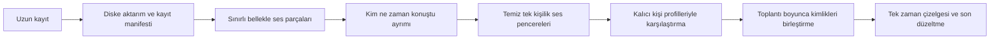

# Uzun toplantılar ve canlı çalışma kararı

10 Eylül 2026 güncellemesi: kullanıcı dosya veya mikrofon kaydı sonrası
konuşmacılı transkript ve otomatik yeni kişi hafızasını şimdi istedi. Güncel kapsam
[002 PRD](../specs/speaker-identity/PRDs/002-long-recording-analysis/PRD.md) ve
[kullanıcı akışında](MEETING_WORKFLOW.md) kayıtlıdır. Aşağıdaki 9 Eylül sıralaması
tarihsel gerekçedir; 002'nin güncel önceliğini veya transkript/mikrofon kapsamını
sınırlamaz. 001 doğruluk kabulü açık, kayıt sürerken sonuç üretme 003 kapsamındadır.

Karar tarihi: 9 Eylül 2026. Kullanıcı teknik sıralamayı asistana bıraktı; seçilen sıra
**gerçek kişi doğruluğu → uzun dosya analizi → canlı analiz**. Bu belge mimari kararı
kaydeder; uzun kayıt veya canlı özelliklerin uygulanmış olduğunu iddia etmez.

## Neden önce doğruluk?

4060'taki 30 saniyelik tekrarlı örnekte 20 işin işlem p95'i 0,87 saniyedir.
Bu, tek konuşmacılı kimlik çıkarımı ve tek teknik profil için ölçümdür; toplantı
bölümleme, dosya aktarımı ve onlarca kişilik doğruluk bu sayıya dahil değildir.
Önce kişiyi farklı oturumda yeniden tanıyabildiğimizi ölçmek, sonraki katmanlarda
hata çıktığında nedenini ayırmamızı sağlar. ECAPA şu an ölçülecek referanstır;
“en doğru model” unvanı test verisi olmadan verilmez.

İlk deney beş bilinen ve iki bilinmeyen kişiyle yapılır; ardından galeri 10, 20 ve
50 kişiye çıkarılır. Model/karar eşikleri ilk kör ölçümden önce sabitlenir. Hata
varsa ayrı geliştirme verisinde model, pencere ve eşik karşılaştırılır; aynı kör
kayıt üzerinde ayar yapıp o kaydı tekrar başarı kanıtı saymayız.
[Kayıt rehberi](DATA_COLLECTION.md) ve [değerlendirme protokolü](EVALUATION_PLAN.md).

## Uzun dosyayı sistem böler

Kullanıcı bir toplantıyı tek kayıt olarak yükler. Uygulama dosyayı diske aktarır;
tamamını belleğe almaz. Aktarım da boyutu sınırlı ve yeniden denenebilir parçalarla
yapılır. Mevcut 120 saniyelik tek konuşmacı endpoint'inin limitini artırmak bu işi
çözmez: bir toplantı parçasında birden fazla kişi bulunabilir.

Başlangıç deney parametremiz **60 saniyelik ana bölgeler, her iki yönde en çok
5 saniye bağlam**. Örneğin 60–120 saniyenin sonucunu üretirken 55–125 saniye okunur;
yalnız 60–120 bölgesi çıktının sahibi olur. İlk ve son parçada sınırlar dosyaya
kırpılır. 30/60/120 saniyelik bölgeler ve 5–10 saniyelik bağlam ayrı deneylerde
karşılaştırılır. Bunlar seçilmiş başlangıç parametreleridir, doğrulanmış optimumlar değildir.

Parçadaki `speaker_0`, sonraki parçadaki `speaker_0` ile aynı kişi sayılmaz.
**Parça etiketi**, **toplantıdaki kişi kümesi** ve **kalıcı kişi kimliği** ayrı
saklanır. Kayıtlı kişiler ortak profil deposuna bağlanır. Tanınmayan kişiler önce
toplantıya ait adaylarda toplanır; yeterli ve tutarlı kanıt olmadan yeni kalıcı
profil oluşturulmaz. Yeni aday kaydı ve olası birleştirme politikası 002 kapsamındadır.

İşler toplantı ve parça kimlikleriyle kalıcı tutulur. Kesinti sonrası tamamlanan
parçalar yeniden üretilmez; eski worker sonucu geçerli sonucu ezemez. Kaynak örnek
indisleri ve çıktı sürümleri tutulur; bağlamdaki aynı söz iki kez yazılmaz veya
ses kanıtına iki kez eklenmez. İki kişi aynı anda konuşuyorsa zaman çizelgesinde
bu durum korunur; bu bölge tek kişinin ses profiline eklenmez.

Katılımcı kanalları ayrı geliyorsa ayrı korunur; bütün kanalları erkenden mono
karıştırıp kimlik bilgisini kaybetmeyiz. 4060'ta başlangıçta tek GPU işi yürür;
bellekte tutulan ses ve model batch'i kayıt uzadıkça büyümez. Disk kullanımı,
ilerleme, iptal, yeniden başlatma ve uzun süreli bellek ölçümleri ayrıca sınanır.
1/2/4 saatlik deneyler ve parça sınırında konuşmacı değişimleri kabul deneyine girer.

## Canlı çalışma mümkün; sonucun olgunlaşması zaman alır

NVIDIA'nın akış modeli önceki konuşmacıları bir önbellekte tutabiliyor. Ancak
incelediğimiz `Streaming Sortformer 4spk-v2.1` en çok dört konuşmacı destekliyor;
beş ve üzeri kayıtta performans düşüşü bildiriliyor. Karttaki 1,04 saniye hesaplama
hariç giriş tamponu gecikmesi; hız ölçümünün cihazı RTX 6000 Ada. Bu yüzden onu
onlarca kişilik hedefin ana modeli veya 4060 gecikme garantisi olarak seçmiyoruz.
[Resmî model kartı](https://huggingface.co/nvidia/diar_streaming_sortformer_4spk-v2.1).

Hazır NVIDIA Voice Agent uygulaması aynı turdaki örtüşmeyi tek baskın konuşmacıya
indirgiyor ve state reset sonrası etiketlemeyi yeniden başlatıyor. Kalıcı toplantı
kimliğini uygulamanın kendi katmanında korumamız gerekir.
[Resmî uygulama davranışı](https://docs.nvidia.com/nemo/labs-voice-agent/about/core-concepts/speech-pipeline/speaker-diarization/).

Uzun dosya hattından sonra, aynı toplantı/kimlik durumunu canlı gelen sesle besleriz.
Başlangıç deneyi: 10–30 saniyelik kayan bağlam, 2–5 saniyede ara güncelleme ve
kimlik için 3–8 saniye temiz konuşma biriktirme. 5–15 saniyelik ön kimlik gecikmesi
ölçülecek bir hedeftir; kısa söz, sessizlik ve belirsizlikte daha uzun sürebilir.
Sonuç önce geçici görünür; yeni ses geldikçe sürümlenebilir, toplantı sonunda
çevrimdışı geçişle düzeltilir. Bu, mevcut batch ECAPA modelini tek başına bir
streaming diarization modeli yapmaz.

Web yüzeyinde parça yükleme için HTTP, ilerleme/ara sonuçlar için Server-Sent
Events (SSE) ilk tercihtir; sabit teknoloji profiliyle uyumludur. Canlı ses kaynağı,
sıra numarası, kayıp/geç gelen parça, tampon sınırı ve yeniden bağlantı politikası
003 kapsamında tanımlanır. Toplantı platformuna bağlanmak ayrıca ele alınır.

## Model seçimi ve açık sınırlar

Community-1 yerelden çevrimdışı çalışmayı ve konuşmacı sayısı sınırlarını destekler;
uzun dosya bölümleme karşılaştırmasının adaylarından biridir. Bu özellikler 50
kişide başarıyı kanıtlamaz. Normal örtüşmeli çıktı esas alınır; yalnız metin
hizalamaya yönelik exclusive çıktı çoklu konuşmacı gerçeğini silmek için kullanılmaz.
[Resmî model kartı](https://huggingface.co/pyannote/speaker-diarization-community-1).

Bu tur yeni model paketi indirilmez, çalışan pilotun limitleri değişmez. Öncelikli
uygulama işi 001'in gerçek veri deneyidir. Uzun dosya ve canlı kapsamları ayrı
[yol haritası](../specs/speaker-identity/roadmap.md) satırlarında tutulur; model,
kalite, bellek ve gecikme seçimi ölçümle kesinleşir.
