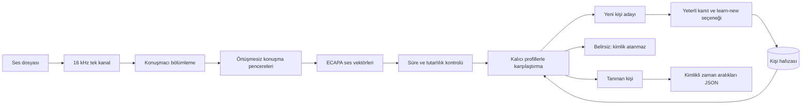

# VoiceUp proje planı

Başlangıç: 8 Eylül 2026. Öncelik, onlarca kayıtlı kişi arasında doğru kalıcı ses kimliği.

Güncel hedef: **NVIDIA DGX Spark / GB10, Linux ARM64, 128 GB ortak CPU/GPU belleği**.
Ürün temeli kullanıcının sağladığı BoilerPlate / kt-scaffold 0.3.0 ile oluşturuldu:
`app/backend/` FastAPI, `app/frontend/` React/Vite, `schema/` PostgreSQL/SQLAlchemy/Alembic.
Önceki Windows/CPU çekirdeği karşılaştırma ve araştırma için korunuyor. Hedef cihazda
kurulum ve hız henüz doğrulanmış değil. Ayrıntılı hedef ortam ve model deneyleri
[DGX_SPARK_PLAN.md](DGX_SPARK_PLAN.md) içinde.

Güncel uygulama önceliği: önce yerel **RTX 4060** üzerinde ürünün temel akışını
çalıştırmak. [Yerel pilot PRD'si](../specs/speaker-identity/PRDs/001-local-speaker-pilot/PRD.md)
Accepted durumundadır; kalıcı profil, tek konuşmacılı WAV/FLAC yükleme ve analiz işi
boilerplate üzerinde uygulanmıştır. [Kullanım rehberi](LOCAL_PILOT.md) kurulumu,
[kanıt raporu](evidence/2026-09-08-local-speaker-pilot/README.md) doğrulanan ve açık
kalan deneyleri gösterir. Spark nihai hedeftir; 4060 kanıtı Spark doğrulaması sayılmaz.

## 9 Eylül sıralama kararı

Kullanıcının devrettiği teknik kararla sıra **gerçek kişi doğruluğu, uzun toplantı
dosyaları, canlı analiz** olarak belirlendi. Uzun dosyalar sınırlı bellekle parça
parça işlenecek; konuşmacı kimlikleri toplantı boyunca birleştirilecek. Sonraki
canlı akış aynı kimlik/zaman çizelgesi katmanını kullanacak. [Karar ve başlangıç
parametreleri](LONG_RECORDING_STRATEGY.md), [002 ve 003 kapsamları](../specs/speaker-identity/roadmap.md).
Mevcut 120 saniyelik tek konuşmacı pilotunun limitini yükseltmek bu özelliklerin yerine geçmez.

## Amaç ve ilk kapsam

İlk toplantıda beş kişiyi ayır; sonraki toplantılarda aynı kişileri aynı kimlikle tanı;
yeni biri geldiğinde yeterli ses kanıtıyla altıncı kimliği oluştur. Gerçek ad, kullanıcı
tarafından verilene kadar `Katılımcı N` olur. Kayıttaki `SPEAKER_00` her dosyada değişebilir;
veritabanındaki `spk_...` kimliği sabittir.

İlk araştırma teslimi yerel dosyadan çalışan Python CLI ve değiştirilebilir model adaptörleridir.
Ürün sağlanan boilerplate'in uygulama katmanları üzerinde geliştirilir; ses algoritmaları
tipli port ve ayrı model servisiyle çağrılır. Web arayüzü ilk pilotta vardır.
Metne çevirme, Zoom/Teams/Meet bağlantısı ve canlı akış sonraki aşamalardır.
Yeni bir kişi eklemek, model ağırlıklarının tekrar eğitilmesi anlamına gelmez. İlk sürüm
önceden eğitilmiş modelden ses vektörleri çıkarır ve kişi başına örnek saklar.

## Çok konuşmacılı araştırma hattı ve hedef

Diyagram araştırma CLI'ının çok konuşmacılı hedefini gösterir. Ürün pilotu yalnız tek
konuşmacılı dosya kabul eder ve otomatik yeni kişi eklemez. Kişi hafızası araştırmada
SQLite, üründe PostgreSQL/pgvector'dür. CUDA çıkarımı ayrı Python/glibc ortamında, web
backend'i sabit FastAPI profilindedir. HTTP sözleşmesi uygulanmıştır; model paketi
önceden hazırlanır ve çalışma anında internetten indirilmez.

Diyagramdaki belirsiz kolunda kimlik atanmaz. Tek konuşmacılı enrollment/identify
komutları bölümleme yerine Silero VAD kullanır; bu dosyalarda tek kişi bulunması gerekir.
`analyze` karışık kayıtta Community-1 kullanır. Alternatif olarak insan tarafından
doğrulanmış konuşma aralıkları verilebilir; bu yöntem otomatik bölümlemeyi test etmez.

## Aşamalar ve tamamlanma ölçütleri

| Aşama | İş | Tamamlanma ölçütü |
| --- | --- | --- |
| 1. Yerel tek konuşmacı pilotu — 001 | RTX 4060/CUDA, kalıcı profiller ve tek konuşmacılı analiz | Yazılım ve teknik GPU akışı doğrulandı; ayrı oturumlarda gerçek kişi ölçümü T09 kapsamında açık. |
| 2. Türkçe kimlik doğruluğu — 001/T09 ve ölçek deneyi | Önce 5 kayıtlı + 2 bilinmeyen, sonra 10/20/50 kişilik galeri; gerekirse model karşılaştırması | Ayrı oturum/kör test, yanlış kabul ve doğru tanıma oranları; eşikler yalnız geliştirme verisiyle seçilir. |
| 3. Uzun toplantı dosyaları — 002 | Sınırlı bloklar, çok konuşmacılı bölümleme, toplantı boyunca kimlik birleştirme ve kesintiden devam | 1/2/4 saatlik gerçek dosyada bellek sınırı, zaman doğruluğu ve kimlik sürekliliği ölçülür. Draft; uygulanmadı. |
| 4. Canlı kimlik analizi — 003 | Kayan ses pencereleri, geçici/düzeltilmiş sonuçlar ve bağlantı devamı | 4060 üzerinde gerçek gecikme, doğruluk, bellek ve bağlantı kaybı deneyleri. Draft; uygulanmadı. |
| 5. Kalan ürün kapsamı | Profil düzeltme/birleştirme; kim ne söyledi; toplantı platformu bağlantısı | Ayrı yetenek gereksinimleri ve testleri tanımlanacak; kullanıcı önceliği kimlik doğruluğudur. |

Takvim, pilot veri toplama ve ölçümden sonra kesinleştirilecek. Birinci aşamadaki
programlama testlerinin geçmesi ikinci aşamadaki doğruluk hedefinin karşılandığı anlamına gelmez.

## Araştırma CLI'ının karar kuralları

- Her model revision'ı ayrı embedding uzayıdır. Yanlış model veya boyutla veritabanı açma/eşleme reddedilir.
- Kişi skoru, normalize edilmiş örneklerin normalize edilmiş ortalamasıyla kosinüs benzerliğidir.
- Başlangıç eşikleri: tanıma `0.75`, yeni aday `0.45`, birinci–ikinci aday farkı `0.10`.
  Bunlar Türkçe veriyle kalibre edilmemiş geliştirme ayarlarıdır; yüzde güven değildir.
- En az 3 saniyelik kesintisiz, başka kişiyle örtüşmeyen pencereler kullanılır. Pencereler
  en fazla 8 saniye; hesaplama kişi başına kayda yayılmış en fazla 20 pencereyle sınırlıdır.
- Pencereler arası en düşük benzerlik `0.55` altındaysa küme belirsizdir. Bu kalite
  eşiği de kalibre edilecektir. Sessizlik ve ağır kırpılma kontrolleri ayrıca uygulanır.
- Yeni kalıcı kişi için en az 10 saniye kullanılabilir ses, en az iki tutarlı pencere
  ve `--learn-new` gerekir. İlk kısa söz yalnızca aday bırakılır. Otomatik tanıma mevcut
  profili güncellemez; doğrulanmış yeni örnek `enroll --speaker-id` ile eklenebilir.
- Bir anda konuşan iki yerel etiket aynı kalıcı kişiye eşlenirse karar belirsize düşer.
  Bu kontroller gerçek bölümleme hatalarının tamamını yakalayamaz.
- Araştırma CLI'ında her kişinin en çok 20 açıkça eklenmiş örneği saklanır. Limit dolunca en eski
  örnek çıkarılır. İsim değiştirme ve profil silme komutları vardır; örnek bazında geri
  alma ve profil birleştirme henüz yoktur.

Ürün pilotunun farkı: kullanıcı arayüzünden açık enrollment yapılır; 20 örnek dolunca
yeni ekleme reddedilir. Önceki örnek sessizce çıkarılmaz. Güncel ürün davranışı Accepted
PRD ve [kullanım rehberinde](LOCAL_PILOT.md) tanımlıdır.

## Ölçek ve altyapı

50 adet 192 boyutlu profilin vektör karşılaştırması küçük bir iştir. Zor kısım farklı
mikrofonlardan, kısa konuşmalardan ve benzer seslerden güvenilir temsil çıkarmaktır.
Kayıtlı kişi sayısı ile aynı toplantıda konuşan kişi sayısı ayrı ölçülür.

İlk araştırma prototipi Windows/Python 3.12 üzerinde CPU paketleriyle doğrulandı.
Güncel ürün pilotunda RTX 4060 Laptop ve Python 3.13/CUDA çıkarımı da çalıştırıldı.
Şimdiki doğruluk deneyi 4060, nihai ölçek hedefi Spark'tır. Mevcut CPU kilidi Spark
kurulumu olarak kullanılmayacak. Hedef NVIDIA container'ı, ARM64 ses kütüphaneleri ve
gerçek CUDA çıkarımı birlikte doğrulanacak. Büyük bellek sayesinde ResNet293-LM ve
ERes2NetV2 öncelikli karşılaştırma adaylarıdır; doğruluk, parti boyutu ve eşzamanlılık
ayrı ölçülecek. İlk CLI dosyayı RAM'e alır. Ürün pilotu süre/boyut sınırları ve
kalıcı iş kuyruğu uygular; uzun toplantıları parça işleme ayrı yetenektir.

Üretim sürümünde kullanıcı/kurum başına ayrı profil alanı, kayıt izni akışı, saklama/silme
süreleri, erişim kontrolü ve şifreleme uygulanacak. Prototip SQLite dosyası şifreli değildir;
yerel kullanıcı erişim sınırlarına dayanır. Ses dosyaları ve embedding veritabanı Git'e
alınmaz. Kimlik doğrulama/giriş güvenliği bu projenin ilk kapsamı değildir.

## Sonraki somut deney

Önce 5 kişinin kişi başına 20–30 saniyelik tek konuşmacılı kayıtlarıyla enrollment;
başka oturumdaki kayıtlarıyla tanıma. Ardından yeni bir kişinin örneği ve üçüncü oturumda
bu kişinin tekrar gelişi. Başarılı/yanlış/belirsiz kararlar kaydedilir; eşikler yalnız
geliştirme kümesinde ayarlanır. Veri planı ve hedeflerin ayrıntısı
[EVALUATION_PLAN.md](EVALUATION_PLAN.md), model gerekçeleri
[MODEL_RESEARCH.md](MODEL_RESEARCH.md) içindedir.
