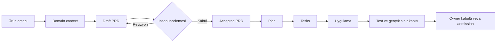
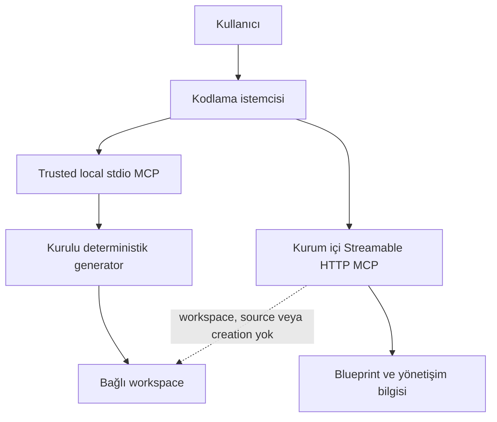

# kt-scaffold

> Boş bir dizini; sabit teknoloji profili, domain-first ürün sözleşmeleri, kodlama ajanı
> yönetişimi, kalite kapıları ve doğrulanabilir teslim kanıtlarıyla birlikte çalışan kurumsal bir
> uygulama deposuna dönüştürür.

`kt-scaffold`, kapalı ağ ve kontrollü yazılım tedarik zinciri koşulları için geliştirilmiş,
offline-first bir proje fabrikasıdır. Ürünün amacı bir ajana “dosya yazdırmak” değil; ürün
niyetinden çalışan davranışa ve teslim kanıtına kadar aynı sözleşmenin izlenebilmesini sağlamaktır.

## Hızlı erişim

- **İlk projenizi oluşturacaksanız:** [Kullanıcı onboardingi](#1-kullanıcı-onboardingi)
- **Bu depoda geliştirme yapacaksanız:** [Geliştirici onboardingi](#2-geliştirici-onboardingi)
- **PRD yaşam döngüsünü arıyorsanız:** [Spec-first teslim akışı](#3-spec-first-teslim-akışı)
- **CLI ve MCP ayrımını merak ediyorsanız:** [Yetki sınırları](#4-cli-ve-mcp-yetki-sınırları)
- **Ajan istemcilerini yapılandıracaksanız:** [İstemci katmanları](#5-kodlama-istemcileri-ve-agent-platform)
- **Ayrıntılı rehberler:** [Türkçe dokümantasyon](docs/tr/README.md) ·
  [İngilizce dokümantasyon](docs/en/README.md) · [MCP sözleşmesi](docs/global-mcp.md)

## Bir bakışta ürün

| Soru | Kısa yanıt |
|---|---|
| Ne üretir? | Çalıştırılabilir uygulama temeli, domain/spec yapısı, sabit teknoloji profili, ajan yönetişimi, test ve deployment varlıkları |
| Nerede çalışır? | Yerel CLI, workspace'e bağlı trusted local stdio MCP ve workspace-blind kurum içi HTTP MCP yüzeylerinde |
| Teknoloji seçilebilir mi? | Hayır. Backend/persistence ve varsayılan frontend profili platform tarafından sabitlenir |
| İş kodu ne zaman başlar? | İlgili capability PRD'si insan sahibi tarafından `Status: Accepted` yapıldıktan sonra |
| Ajanın “tamamlandı” demesi yeterli mi? | Hayır. Bağımsız test, gerçek sınır kabulü ve gerektiğinde owner admission gerekir |
| İnternet zorunlu mu? | Hayır. Üretilen sistem runtime internet bağımlılığı taşımaz; build/test girdileri kabul edilmiş offline bundle'dan gelir |



## Kim nereden başlamalı?

| Rol | İlk okuma | İlk hedef |
|---|---|---|
| Ürün sahibi / analist | [Spec, PRD, plan ve task](docs/tr/04-spec-prd-plan-task.md) | Domain sınırını ve ölçülebilir kabul kriterlerini netleştirmek |
| Uygulama geliştiricisi | [Hızlı başlangıç](docs/tr/02-hizli-baslangic.md) | Boş workspace'te deterministik proje oluşturmak |
| Boilerplate geliştiricisi | [Geliştirici onboardingi](#2-geliştirici-onboardingi) | Generator değişikliğini test ve sözleşmelerle doğrulamak |
| Platform / DevOps | [Kapalı devre operasyon](docs/tr/10-kapali-devre-operasyon.md) | Bundle, image, Helm ve runner kabul sınırlarını işletmek |
| Güvenlik / kanıt inceleyicisi | [Kanıt seviyeleri](docs/tr/referans/kanit-seviyeleri.md) | Yazılı iddia, test, gerçek sınır ve owner kabulünü ayırmak |

## Ön koşullar

Bu depoda geliştirme yapmak için:

- Python `3.13.x`;
- Git;
- kabul edilmiş geliştirme bağımlılıklarına erişim;
- tam stack ve browser doğrulaması için kurumun sağladığı offline bundle, Docker/Compose ve uyumlu
  Playwright Chromium varlığı gerekir.

Üretilmiş bir projeyi yalnızca kullanacaksanız kurumsal olarak paketlenmiş/pinlenmiş `kt-scaffold`
kurulumunu tercih edin. Public registry veya mutable `latest` kaynağını doğrudan güven sınırı olarak
kullanmayın.

## 1. Kullanıcı onboardingi

### Seçenek A — CLI ile proje oluşturma

Boş veya henüz oluşmamış bir hedef dizin seçin:

```sh
kt-scaffold init \
  --target-dir ./mutabakat-servisi \
  --intent "Yetkili kullanıcılar ödeme mutabakat kayıtlarını yönetsin" \
  --primary-domain mutabakat \
  --agent-client github-copilot-vscode
```

`--agent-client` opsiyoneldir ve birden fazla kez verilebilir. Seçim yalnız inert Agent Platform
çıktılarını belirler; herhangi bir istemciyi canlı olarak aktive veya admit etmez.

Başarılı ilk üretimden sonra:

1. `.kt-scaffold/answers.yml` içindeki secret olmayan girdileri kontrol edin.
2. `technology-profile.yml` içindeki sabit teknoloji kararlarını okuyun.
3. `specs/mutabakat/DOMAIN.md` içinde domain dilini ve sahiplik sınırını netleştirin.
4. Yeni capability için Draft PRD oluşturun.
5. İş koduna başlamadan önce PRD'nin insan sahibi tarafından kabul edilmesini bekleyin.
6. Uygulama sonunda ilgili test ve gerçek sınır kanıtını kaydedin.

### Seçenek B — Kodlama istemcisinden yerel MCP ile proje oluşturma

Kurulu paketi, istemcinin açtığı boş workspace'e sabitleyin:

```sh
kt-scaffold mcp \
  --transport stdio \
  --workspace-root /mutlak/yol/bos-workspace
```

Trusted local stdio yüzeyi:

- `project_start` / `proje_baslat` prompt'u ile eksik iş bağlamını toplar;
- `project_create` / `proje_olustur` aracıyla kurulu generator'ı in-process çağırır;
- hedef yolu model-facing tool şemasına koymaz;
- shell, package manager, migration, VCS komutu veya indirilen executable çalıştırmaz;
- dosya/entry sayıları ile expected/observed tree digest içeren `local-mcp-observed` receipt döndürür.

Tamamlanmış birebir tekrar `unchanged` dönebilir. Kısmi, düzenlenmiş, symlink veya sahiplenilmemiş
hedef fail-closed davranır; sessiz overwrite yapılmaz.

## 2. Geliştirici onboardingi

### Yerel ortamı hazırlama

Repo kökünde:

```sh
python3.13 -m venv .venv
.venv/bin/pip install -e '.[test]'
```

Kurulumu hızlıca doğrulayın:

```sh
.venv/bin/kt-scaffold --version
.venv/bin/pytest -q
.venv/bin/ruff check .
.venv/bin/ruff format --check .
.venv/bin/mypy
```

### Değişiklik yaparken izlenecek sıra

1. `git status --short --branch` ile mevcut kullanıcı değişikliklerini görün.
2. Değiştireceğiniz davranışın kanonik kaynağını bulun.
3. Accepted PRD, plan ve task kapsamını doğrulayın.
4. Önce dar sözleşme testini, sonra ilgili entegrasyon testini çalıştırın.
5. Generated projection dosyasını elle düzeltmek yerine kaynağı değiştirip yeniden render edin.
6. Tamamlandı iddiasından önce `pytest`, Ruff, mypy ve `git diff --check` sonuçlarını kaydedin.
7. Gerçek database, browser, MCP veya client sınırı gerekiyorsa mock sonucunu L2 kanıtı gibi sunmayın.

Başlıca kanonik kaynaklar:

| Yol | Sorumluluk |
|---|---|
| `specs/` | Domain-first ürün gereksinimleri, roadmap, PRD, plan ve task |
| `rules/` | Mühendislik ve kalite yönetişiminin kanonik corpus'u |
| `technology-profile.yml` | Zorunlu, koşullu ve yasaklı teknoloji kararları |
| `agent-platform/` | Custom-agent sözleşmeleri, client capability matrisi ve conformance kayıtları |
| `src/kt_scaffold/` | Generator, CLI, MCP ve operation uygulaması |
| `src/kt_scaffold/templates/` | Üretilen depoya taşınan/render edilen içerik |
| `tests/` | Çalıştırılabilir kabul ve regresyon sözleşmesi |
| `docs/evidence/` | Tarihli test ve kaynak doğrulama kayıtları |

## 3. Spec-first teslim akışı

Yeni bir capability doğrudan backend/page/schema komutuyla başlamaz.

```sh
kt-scaffold spec \
  --target-dir . \
  --domain mutabakat \
  --capability islem-arama \
  --intent "Yetkili operatör mutabakat işlemlerini bulabilsin"
```

Yeni belge `Status: Draft` ile oluşur. İnsan incelemesi; actor/outcome, authorization, veri/migration,
operasyon, risk ve kabul kriterlerini netleştirir. Komut PRD'yi kendi kendine kabul etmez.

Yetki zinciri değişmez:

```text
Domain context
  → Draft PRD
  → İnsan incelemesi
  → Accepted PRD
  → Plan
  → Task'ler
  → Uygulama
  → Kanıt
```

`domain`, `page`, `schema` ve `scenario` işlemleri eksik veya Draft PRD ile iş kodu üretmeyi
reddeder. Top-level `plans/` araştırma/tasarım kaydıdır; Accepted capability PRD'sinin yerine geçmez.

## 4. CLI ve MCP yetki sınırları



| Yüzey | Dosya oluşturur mu? | Workspace görür mü? | Temel kullanım |
|---|---:|---:|---|
| `kt-scaffold init` | Evet | Yalnız açık hedef | Otomasyon ve unattended deterministik bootstrap |
| Trusted local stdio MCP | Evet | Başlangıçta sabitlenen tek root | Kodlama istemcisinden kontrollü ilk proje oluşturma |
| Streamable HTTP MCP | Hayır | Hayır | Blueprint, artifact catalog, update intent ve reconciliation |

HTTP MCP yalnız loopback'e bind olur; kurumsal TLS/mTLS, OAuth 2.1, scope, rate limit ve audit kimliği
gateway/sidecar sorumluluğundadır:

```sh
kt-scaffold mcp \
  --transport streamable-http \
  --host 127.0.0.1 \
  --port 8000 \
  --path /mcp
```

HTTP yüzeyi `project_create`, prompt, workspace snapshot, executable bundle veya applicator sunmaz.
MCP reconciliation receipt'i execution kanıtı değildir.

## 5. Kodlama istemcileri ve Agent Platform

İki farklı projeksiyon katmanını karıştırmayın.

### Mühendislik-yönetişimi projeksiyonları

Kanonik `rules/` corpus'u dört yerleşik kodlama ortamına yansıtılır:

- Claude Code: `CLAUDE.md`, `.claude/rules/`, `.claude/skills/`
- Codex: `AGENTS.md`, `.codex/config.toml`, `.codex/skills/`
- Cursor: `.cursor/rules/*.mdc`
- VS Code Local Agent: `AGENTS.md`, `.claude/rules/`, `.claude/skills/`

Tam kapalı ve yerel model profilinin varsayılan mühendislik ortamı VS Code Local Agent'tır. Diğer
istemciler yalnız gerekli servislerin ve veri politikasının onaylandığı ağ bölgelerinde kullanılır.

### Agent Platform custom-agent projeksiyonları

Compiler dört native adapter hedefler:

| Hedef | Canlı discovery yolu |
|---|---|
| Codex | `.codex/agents/` |
| Claude Code | `.claude/agents/` |
| VS Code içinde GitHub Copilot | `.github/agents/` |
| Cursor | `.cursor/agents/` |

Init/render çıktıları önce `.kt-scaffold/agent-projections/` altında inert kalır. Discovery yoluna
activation; yalnız disposable conformance grant veya exact client/model/tool/policy/environment
tuple'ına bağlı, imzalı ve süreli admission receipt ile yapılır.

Adapter üretimi, gerçek istemci conformance'ı, runtime admission ve bağımsız certification farklı
durumlardır. Güncel Agent Platform sözleşmesinde dört serializer ve 16 deterministik çıktı vardır;
hiçbir exact runtime tuple admitted değildir.

Ayrıntı: [Kodlama istemcileri ve Agent Platform](docs/tr/05-ajan-istemcileri.md).

## 6. Sabit teknoloji profili

| Katman | Karar |
|---|---|
| Backend | Python 3.13 + FastAPI |
| Persistence | PostgreSQL + async SQLAlchemy + asyncpg |
| Migration otoritesi | Alembic; declared desired state kaynak kabul edilir |
| Frontend | Ayrık React/Vite SPA |
| Kimlik/yetki | JWT + tenant-aware RBAC + uygulama seviyesinde `super_admin` |
| Streaming | SSE kullanılabilir |
| Yasaklı varsayımlar | SSR, Next.js, Node/NestJS/Prisma backend ve ajan tarafından framework seçimi |

PGVector ayrı bir vector database değildir. Yalnız Accepted PRD; embedding provider/model sürümü,
dimension, distance metric, indeks, tenant kapsamı ve re-embedding yaşam döngüsünü sahiplenirse aynı
PostgreSQL içinde aktive edilebilir.

Tamamı prompt girişi, chat response ve history'den oluşan sınırlı ürünlerde
`technology-profile.yml` tarafından tanımlanan Streamlit istisnası kullanılabilir.

## 7. Üretilen depo haritası

```text
proje/
├── .kt-scaffold/                 # answers, manifest, evidence ve inert agent projections
├── specs/<domain>/               # DOMAIN.md, roadmap ve capability PRD'leri
├── rules/                        # kanonik mühendislik kuralları
├── app/backend/                  # FastAPI uygulama katmanları
├── app/frontend/                 # React/Vite SPA
├── schema/                       # persistence desired state ve Alembic migration'ları
├── e2e/                          # browser acceptance senaryoları
├── helm/                         # Kubernetes deployment varlıkları
├── scripts/                      # onaylı operasyon ve kalite girişleri
├── technology-profile.yml        # sabit teknoloji otoritesi
└── AGENTS.md / CLAUDE.md / ...   # generated istemci yönetişimi projeksiyonları
```

`.kt-scaffold/project-manifest.json` bounded proje/yönetişim metadata'sıdır ve onaylı MCP endpoint'ine
gönderilebilir. `.kt-scaffold/managed-manifest.json` yerel managed-file durumudur; MCP'ye gönderilmez.
Source, secret, dependency tree ve database içeriği uzak yönetişim sözleşmesinin dışındadır.

## 8. Kalite ve kanıt modeli

| Seviye | Anlam | Sağlamadığı iddia |
|---|---|---|
| L0 — Yazılı | Değişiklik dosyada/diff'te var | Çalıştığı veya gereksinimi karşıladığı |
| L1 — Test gözlendi | İlgili deterministik, unit ve integration kontrolleri çalıştı | Gerçek sınır acceptance/conformance veya owner kabulü |
| L2 — Gerçek sınır gözlendi | Domain'e uygun gerçek HTTP/browser, MCP veya exact-client senaryosu geçti | Owner kabulü veya runtime admission |
| L3 — Owner kabulü/admission | Exact kapsam ve kanıt için sorumlu owner kararı var | Gelecek sürüm/model/tool/policy/ortamların otomatik kabulü |

Her kanıt; komut/senaryo, ortam ve sürüm, exit code, test sayısı, skip/failure, provenance ve tarih
taşır. Boilerplate testlerinin geçmesi, üretilen projenin database/browser kapısının geçtiği anlamına
gelmez.

Güncel tarihli kayıtlar:

- [Test matrisi](docs/evidence/test-matrisi.md)
- [Kaynak doğrulama kaydı](docs/evidence/kaynak-dogrulama-kaydi.md)
- [Agent Platform durumu](agent-platform/README.md)

## 9. Kapalı ağ ve CI sınırı

Repository CI egress-blocked, self-hosted runner üzerinde çalışır. `dependency-admission.json` doğrudan
Python/npm bağımlılıklarını, OCI digest'lerini ve workflow action'larını tek kabul envanterine bağlar.
Package manager'lar no-index/offline modunda çalışır; Gitleaks, Semgrep ve Trivy yalnız checksum ile
kabul edilmiş, kapalı ve symlink içermeyen scanner snapshot'ını tüketir.

`packaging/offline-bundle.sh`; wheelhouse, npm cache, eşleşen Playwright Chromium varlığı ve OCI
export'u kontrollü yazılım tedarik zincirine taşımak için hazırlar. Bundle oluşturulmuş olması tek
başına release admission değildir; platform, digest, imza, SBOM/provenance ve güncel security scan
kanıtları ayrıca değerlendirilir.

CI ayrıntısı: [Offline runner sözleşmesi](.github/workflows/README.md).

## 10. Sık yapılan hatalar

| Hata | Doğru yaklaşım |
|---|---|
| Draft PRD ile iş koduna başlamak | Önce insan review ve `Status: Accepted` kararı |
| Generated client dosyasını elle düzeltmek | Kanonik `rules/` veya Agent Platform contract'ını değiştirip yeniden render etmek |
| HTTP MCP'den proje oluşturmasını beklemek | CLI veya workspace-bound trusted local stdio kullanmak |
| Adapter çıktısını runtime desteği saymak | Conformance ve süreli owner admission kanıtını ayrı doğrulamak |
| Exit code `0` değerini tek başına kanıt saymak | Beklenen step/test marker'larını, skip/failure ve provenance'ı incelemek |
| Public registry veya `latest` ile offline kabulü aşmak | Pinlenmiş ve digest'i onaylı bundle/image kullanmak |
| Ajanın başarı mesajını teslim kanıtı saymak | Testi gerçek sınırda bağımsız çalıştırıp sonucu kaydetmek |

Sorun çözme: [Türkçe sorun giderme rehberi](docs/tr/11-sorun-giderme.md).

## 11. Dokümantasyon haritası

| İhtiyaç | Belge |
|---|---|
| Ürünü ve sabit kararları anlamak | [Genel bakış](docs/tr/01-genel-bakis.md) |
| İlk projeyi oluşturmak | [Hızlı başlangıç](docs/tr/02-hizli-baslangic.md) |
| Mimari ve sorumlulukları görmek | [Mimari ve sorumluluklar](docs/tr/03-mimari-ve-sorumluluklar.md) |
| PRD yaşam döngüsünü uygulamak | [Spec, PRD, plan ve task](docs/tr/04-spec-prd-plan-task.md) |
| Kodlama istemcilerini anlamak | [Kodlama istemcileri ve Agent Platform](docs/tr/05-ajan-istemcileri.md) |
| CLI komutlarını kullanmak | [CLI kullanım rehberi](docs/tr/06-cli-kullanim-rehberi.md) |
| MCP kaydı ve araçlarını kullanmak | [MCP kullanım rehberi](docs/tr/07-mcp-kullanim-rehberi.md) |
| Managed update ve reconciliation yapmak | [Güncelleme ve uyumlaştırma](docs/tr/08-guncelleme-ve-uyumlastirma.md) |
| Kalite ve E2E kanıtını yorumlamak | [Kalite, kanıt ve E2E](docs/tr/09-kalite-kanit-ve-e2e.md) |
| Kapalı devre operasyonu yürütmek | [Kapalı devre operasyon](docs/tr/10-kapali-devre-operasyon.md) |
| Dizin, komut, manifest ve kanıt referansı | [Türkçe dokümantasyon indeksi](docs/tr/README.md) |

## Son not

Bu ürünün güvenilirliği yalnız ürettiği dosya sayısından gelmez. Esas sözleşme; ürün kararının
Accepted PRD ile sahiplenilmesi, generator çıktısının deterministik olması, yönetişimin kanonik
kaynaktan türetilmesi ve her teslim iddiasının uygun gerçek sınırda kanıtlanmasıdır.
